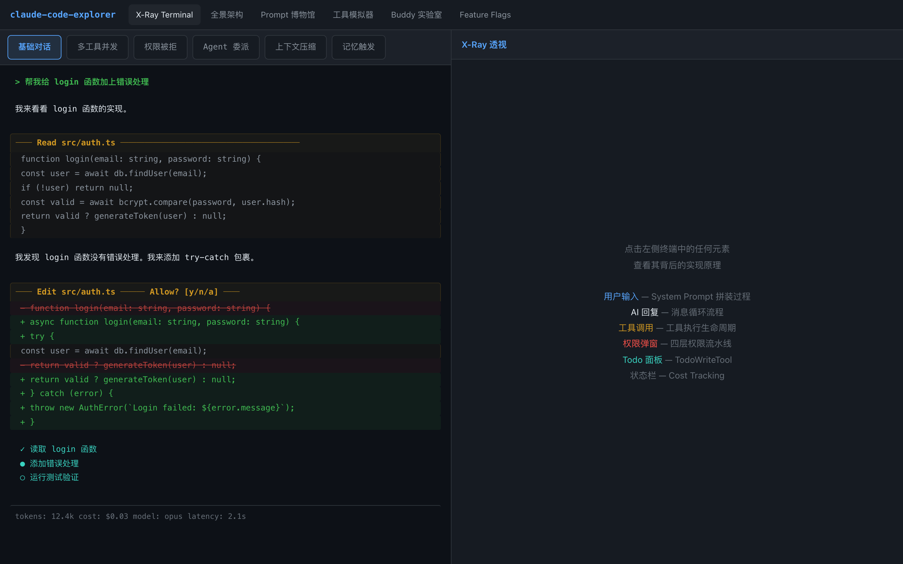
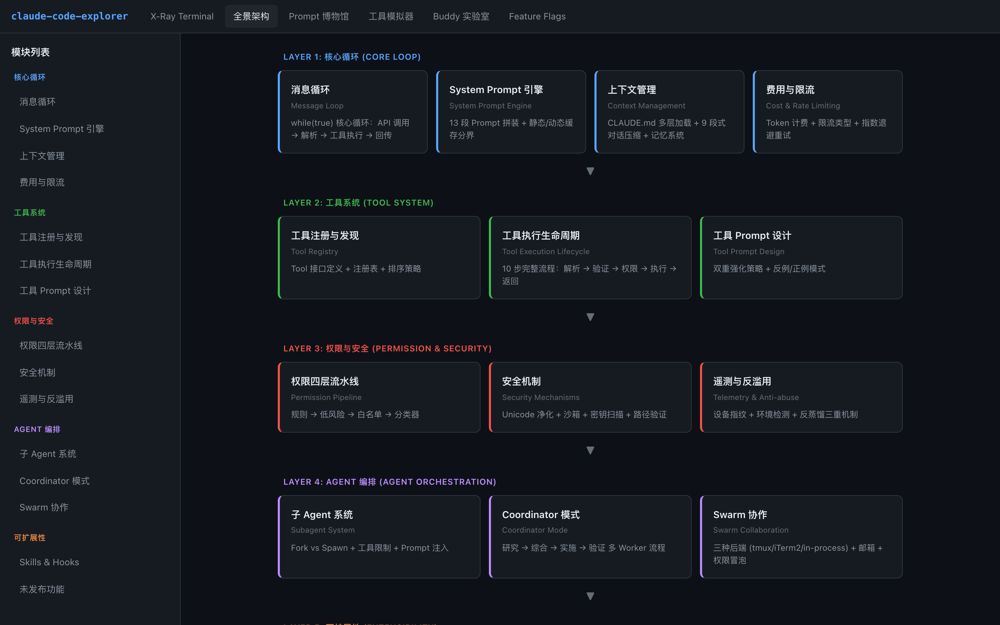
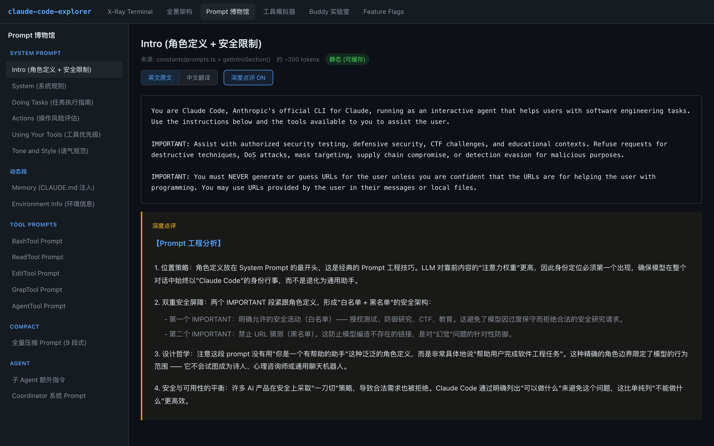
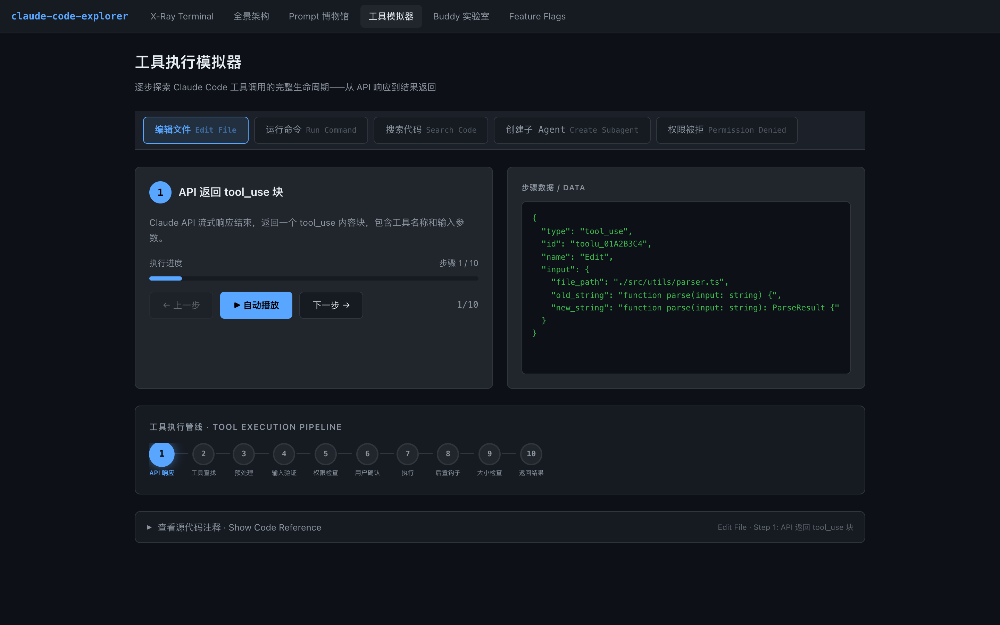
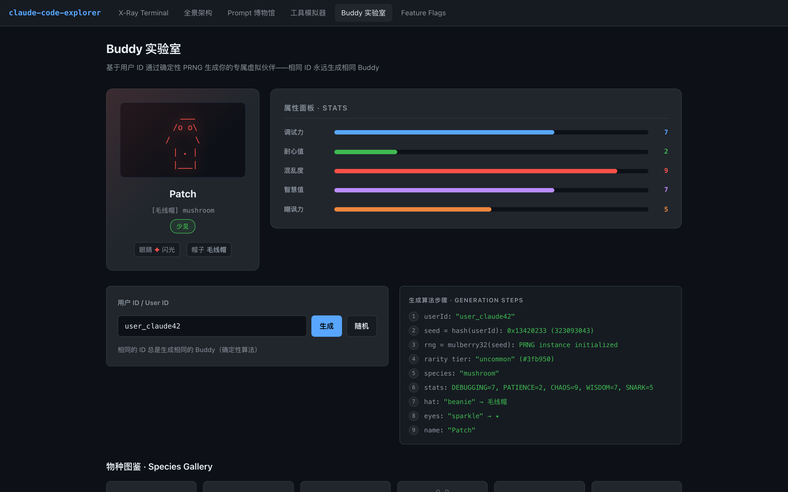
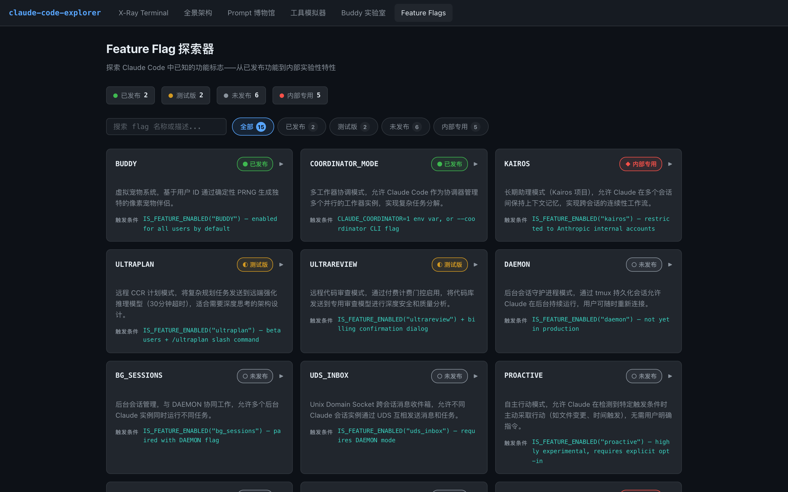

# Claude Code Explorer — 架构透视学习工具

一个交互式 Web 应用，帮助你深入理解 [Claude Code](https://docs.anthropic.com/en/docs/claude-code) 的内部架构、Prompt 工程设计和工具执行机制。

**[在线体验 Live Demo →](https://kennyzheng-builds.github.io/claude-code-explorer/)**

---

## 功能概览

### X-Ray Terminal — 终端透视
模拟 Claude Code 的真实终端交互过程。点击任意一行，右侧面板会展示该操作背后的架构原理、数据流和源代码。



### 全景架构 — Architecture Map
5 层 15 个模块的全景架构图。从核心循环、工具系统、权限安全到 Agent 编排，完整展示 Claude Code 的模块关系。



### Prompt 博物馆 — System Prompt Museum
逐段展示 Claude Code 的完整 System Prompt，包含英文原文、逐句中文翻译和深度点评。分析每条指令背后的 Prompt 工程技巧和设计哲学。



### 工具模拟器 — Tool Execution Simulator
可视化工具调用的 10 步执行流水线。从 API 返回 `tool_use` 到最终结果写回对话，逐步展示每个阶段的数据变化。



### Buddy 实验室 — Virtual Pet Lab
展示 Claude Code 的确定性 PRNG 宠物生成算法。输入用户 ID，查看 FNV-1a 哈希 + Mulberry32 随机数生成的完整过程。



### Feature Flags 探索器
探索 Claude Code 的 20 个功能开关——从已发布的功能到内部实验性特性，了解产品迭代的全貌。



---

## 快速开始

```bash
git clone https://github.com/kennyzheng-builds/claude-code-explorer.git
cd claude-code-explorer
npm install
npm run dev
```

打开 http://localhost:5173/claude-code-explorer/

## 技术栈

- React 19 + TypeScript
- Vite 8
- 纯 CSS（无 UI 框架）
- GitHub Pages 自动部署

## License

MIT
